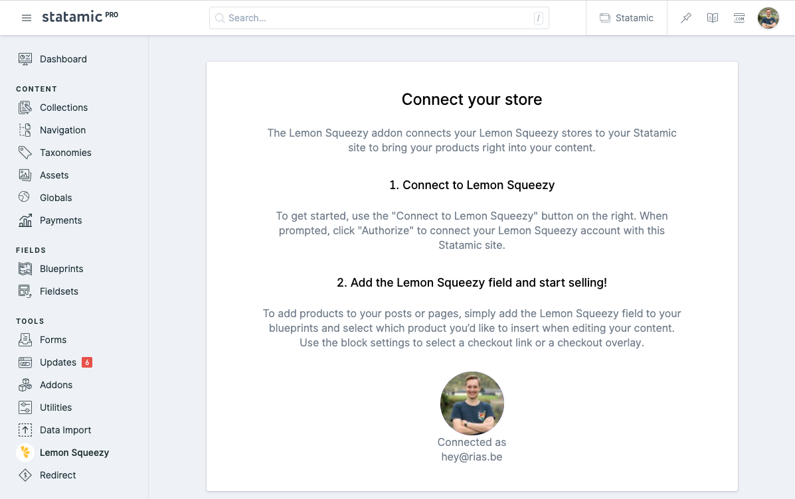

# Statamic Lemon Squeezy



The Lemon Squeezy Statamic addon makes it easy to start selling digital products on your Statamic website without having to take on all of the bloat and maintenance headaches of a traditional e-commerce plugin.

## How to Install

You can search for this addon in the `Tools > Addons` section of the Statamic control panel and click **install**, or run the following command from your project root:

``` bash
composer require rias/statamic-lemon-squeezy
```

## How to Use

Check out the [documentation](https://github.com/riasvdv/statamic-lemon-squeezy/blob/main/DOCUMENTATION.md) for more information.
